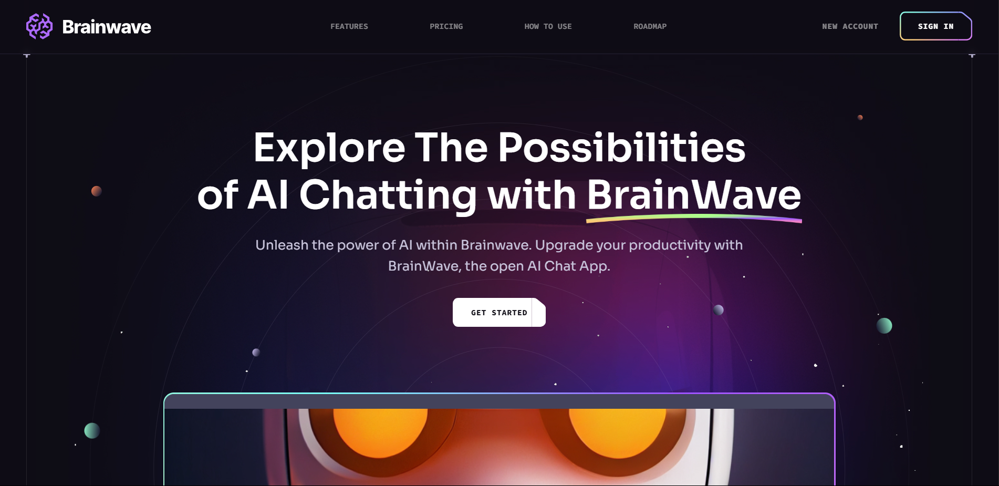
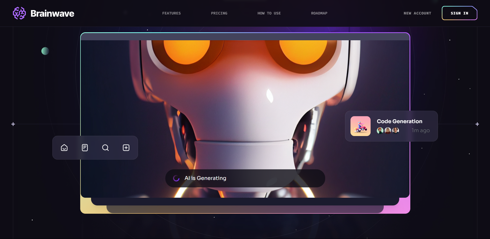
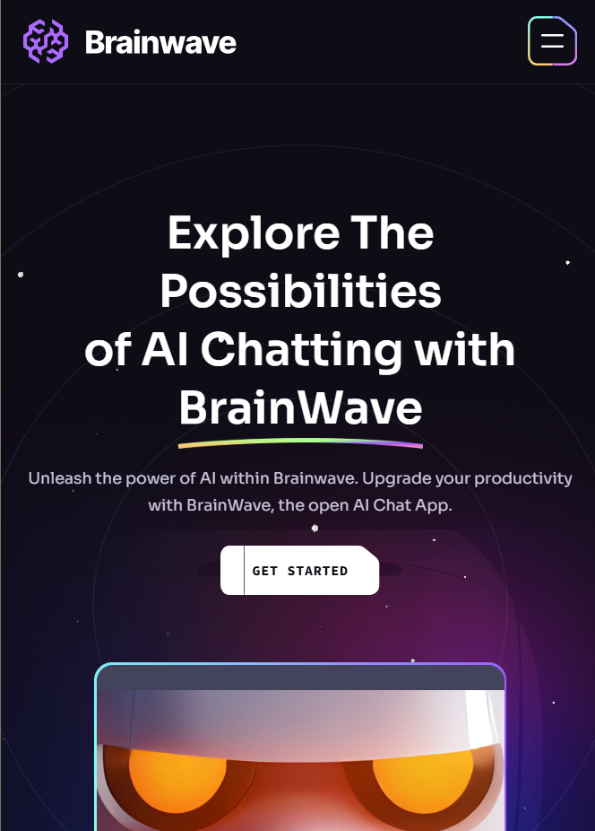
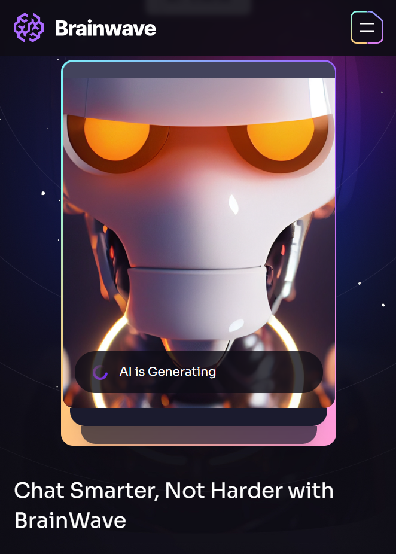
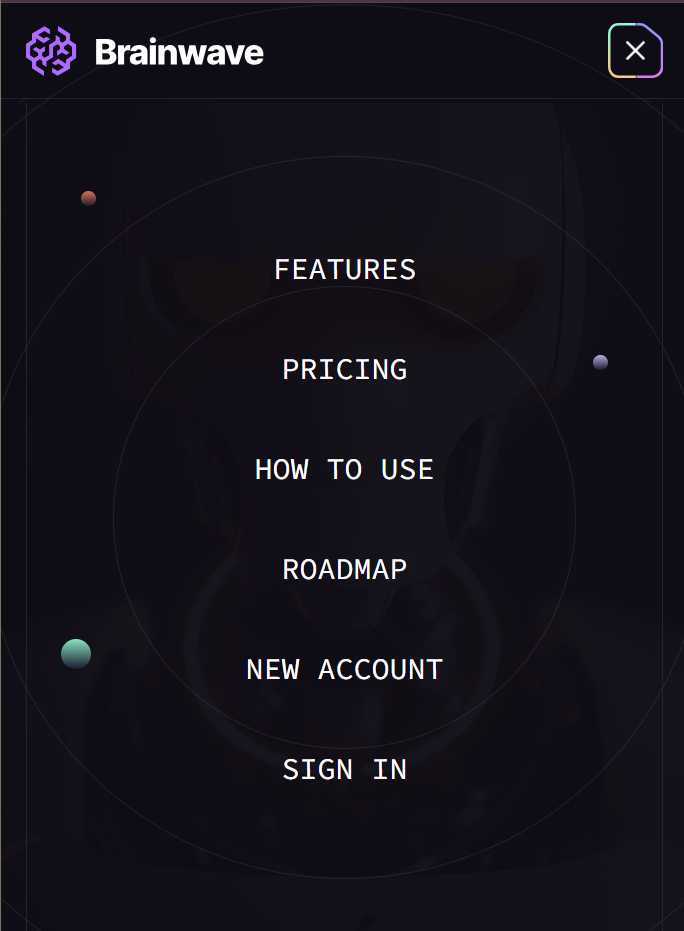
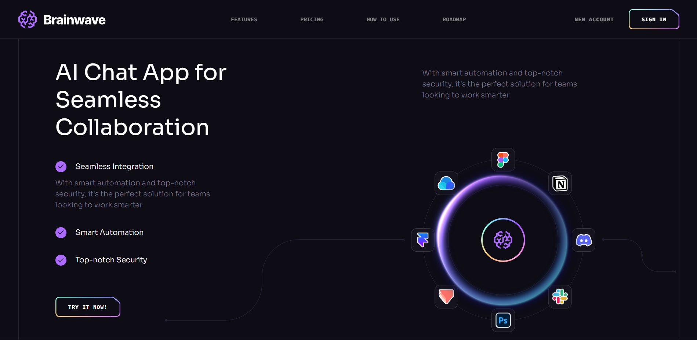

# 💬 AI Chat Frontend Application

This is a **frontend-only React-based application** that simulates a modern, responsive AI chatting interface. It provides an engaging UI for users to interact with an AI assistant in a chat-like environment. The UI is built with performance and accessibility in mind, using React and Tailwind CSS.

> ⚠️ This project is frontend-only and **does not include backend AI logic** or real-time messaging. It is ideal for demos, UI testing, and integration with AI APIs like OpenAI, Cohere, or custom backends.

---

## 🚀 Features

- ⚛️ Built with **React**
- 🎨 Styled using **Tailwind CSS**
- 📱 Fully **responsive** for mobile and desktop
- 🎯 Modular components for easy scaling

---

## 📁 Folder Structure

src/

├── assets/ # Images, icons, and static files

├── components/ # Reusable UI components

├── constants/ # Navigation links and static config

├── pages/ # Page-level components

├── App.jsx # Root component

├── index.js # React entry point

└── styles/ # Global Tailwind styles (optional)

---

## 🛠️ Installation

1. **Clone the repo**

   ```bash
   git clone https://github.com/jahnavvivi/BrainWave.git
   cd BrainWave

   ```

2. **Install Dependencies**

   ```bash
   npm install

   ```

   ```bash
   npm i ogl

   ```

3. **Start Developer Server**
   ```bash
   npm run dev
   ```

## 🔧 Tech Stack

- React – UI library
- Vite – Fast build tool
- Tailwind CSS – Utility-first CSS framework
- React Router DOM – For navigation (if routing is used)

## 🖼️ Screenshots

|                                      |                                      |
| :----------------------------------: | :----------------------------------: |
|  |  |
|  |  |
|  |  |
|  |
